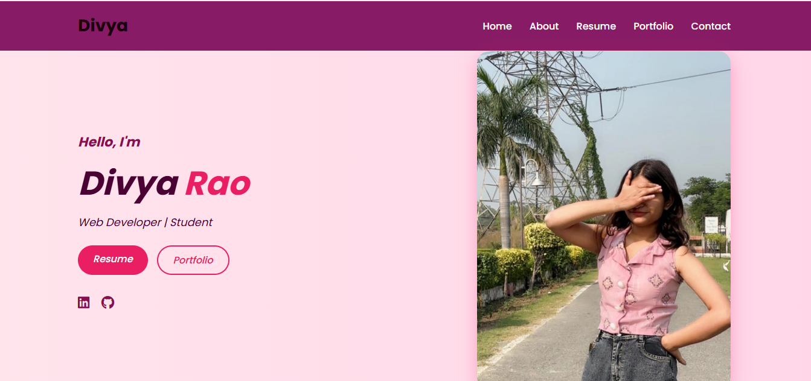
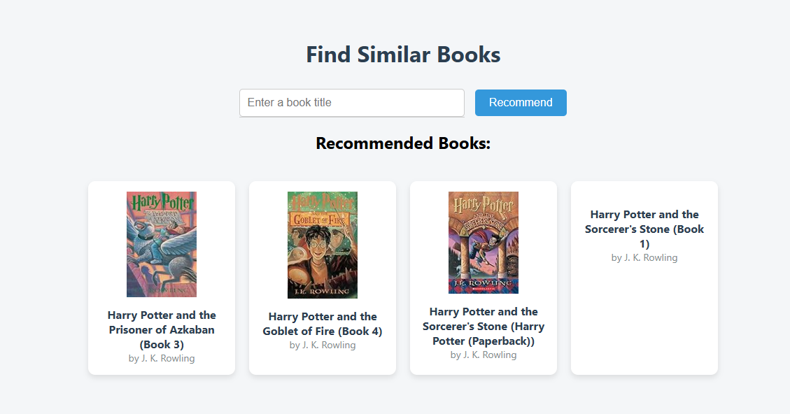

# 🌐 Divya Rao | Personal Portfolio Website

🚀 **Live Demo:**  
👉 https://divyarao0.github.io/portfolio

---

## 👋 About Me

Hi, I’m **Divya Rao**, a **B.Tech Computer Science student** and an **aspiring software & web developer** from India.

I love creating **responsive, clean, and user-friendly websites** using modern technologies. I’m passionate about continuous learning and building real-world projects that strengthen my skills.

---

## 📌 About the Project

This is my **first personal portfolio website**, created to showcase:

- Technical skills  
- Education and certifications  
- Projects and achievements  
- Professional contact details  

The site features a **modern UI design** and works smoothly across devices.

---

## 🛠️ Tech Stack

- **Frontend:** HTML5, CSS3, JavaScript  
- **Languages:** C++, Python  
- **Design:** Figma  
- **Version Control:** Git & GitHub  

---

## 📂 Website Sections

- 🏠 Home  
- 👩‍💼 About  
- 🧠 Skills  
- 📄 Resume  
- 💼 Projects  
- 📬 Contact  

---

## 🧠 Skills

- C++  
- Web Devlopment
- Python (AI/ML)
- Power BI
- Advanced Excel
- GitHub  
- Communication Skills  

---

## 🎓 Certifications

### 🏅 AI in Human Resource Management  
**Platform:** NPTEL (IIT Guwahati)  
**Score:** 73%  
**Duration:** Jan – Apr 2025  

Applied Artificial Intelligence concepts to HR processes such as recruitment, performance evaluation, and employee management.

---

### 🏅 Advanced Computer Networks  
**Platform:** NPTEL  
**Score:** 54%  
**Duration:** Jan – Apr 2025  

Learned advanced networking concepts including routing protocols, congestion control, and network optimization.

---

### 🏅 AI & Machine Learning Training  
**Institute:** MERI Group of Institutions  
**Duration:** July – August 2025 (6 Weeks)  

Completed hands-on training in AI & Machine Learning with practical exposure to modern tools and techniques.

---

## 💼 Projects

### 🌐 Personal Portfolio Website
- Designed and developed a responsive portfolio website
- Showcases skills, education, certifications, and projects

**Tech Used:** HTML | CSS | JavaScript  
🔗 Live Demo Available

---

### 📚 Book Recommender System
- Developed a content-based recommendation system
- Improved recommendation relevance using similarity metrics

**Tech Used:** Python | Machine Learning | Content-Based Filtering  
🔗 Live Demo Available

---

### 📊 Job Market Dashboard
- Built an interactive dashboard to analyze job trends and salary insights
- Used dynamic filters and data modeling for decision-making

**Tech Used:** Power BI | Advanced Excel | Kaggle  
🔗 Live Demo Available

---

## 📬 Contact & Links

- 📧 <a href="mailto:divya85870@gmail.com"><button style="background-color:#0072b1;color:white;border:none;padding:5px 10px;border-radius:5px;cursor:pointer;">Email</button></a>

- 🔗 <a href="https://divyarao0.github.io/portfolio/" target="_blank"><button style="background-color:#4CAF50;color:white;border:none;padding:5px 10px;border-radius:5px;cursor:pointer;">View Portfolio</button></a>

- 🔗 <a href="https://www.linkedin.com/in/divya-rao-2ab3942a6?utm_source=share&utm_campaign=share_via&utm_content=profile&utm_medium=android_app" target="_blank"><button style="background-color:#0077B5;color:white;border:none;padding:5px 10px;border-radius:5px;cursor:pointer;">LinkedIn</button></a>

---

## 🚀 Future Enhancements

- Add animations and interactive UI elements
- Improve accessibility and performance
- Add backend integration
- Deploy more real-world projects

---

## 📜 License

© 2026 Divya Rao | All Rights Reserved
